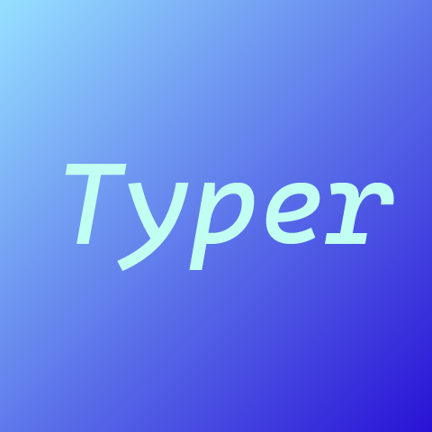

[](https://pkg.go.dev/github.com/ZenkieBear/typer)

<br>
<br>

<p align='center'>
  
</p>

# Typer
Typer is a printer whose output style simulates a typewriter.


# Experience now!
## Prerequisite
Installed [Go](https://go.dev/doc/install) and [Git](https://git-scm.com/downloads) on your personal computer.

## Clone the repository to your PC
```shell
git clone https://github.com/ZenkieBear/typer
```

## Run the `main.go` file
```shell
go run main.go
```


# Import Typer to your application
## Install Typer
```shell
go get github.com/ZenkieBear/typer
```

## Import typer to your go file
```go
import "github.com/ZenkieBear/typer/typer"
```

## Use Typer
```go
func some() {
	typer.Print("Hey Judy\n")
	typer.Println("Don't be afraid")
}
```


# Configuration
Typer supports custom configuration.

You can create a `typer.Typer`, and define properties according to your preferences.

```go
func demo() {
  // ...
	myTyper := typer.Typer{
		Base:       300,
		FloatRange: 50,
		Printer:    fmt.Print,
	}

	if err := myTyper.Print("Hello!"); err != nil {
		fmt.Println(err.Error())
	}
  // ...
}
```

# License
Typer is licensed under [MIT](LICENSE)
